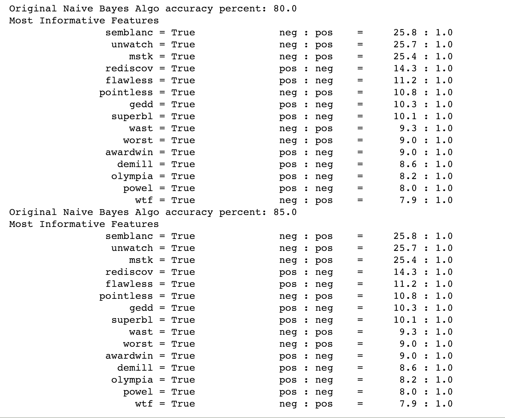

# Simple-Sentiment-Analysis-using-NLTK

### Introduction: 
I built a sentiment analysis model that can classify IMDB movie reviews as either positive or negative. I trained the model using 50000 IMDB movie reviews.

### Process: 

The Algorithm : 
Tokenize, clean and lemmatize the data and took only the adjectives from the reviews. 
Created a frequency distribution and found the most used words in all of the reviews. The top 5000 was used as the features.  

Make features vectors:
Created a dictionary representation of each review. The key in the dictoinary was each of the top words and the corresponding value was True of False for whether 'Word was in the review or not' 
Divdided the data into train test split. 
Use 5 different classification models to train on the data. Namely: 

Classifiers for an ensemble model from NLTK-ScikitLearn library: 
Naive Bayes (NB)
Multinomial NB
Bernoulli NB
Logistic Regression
Stochastic Gradient Descent Classifier - SGD
Support Vector Classification - SVC

Ensemple.py:  Created a classifier class that takes votes from each classifier and takes the mode of the votes to give the final decision with a certain confidence level.
Module.py: Can predict the sentiment of a single review. 

The most used words from the feature set in each category - 

# Acknowledgement

 * Followed this amazing tutorial for the code: https://pythonprogramming.net/sentiment-analysis-module-nltk-tutorial/
 * Dataset - http://ai.stanford.edu/~amaas/data/sentiment/
 
   

